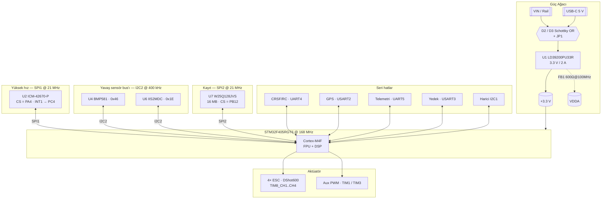

# MiniTULPAR — Özel Tasarım Uçuş Kontrol Kartı (FCB)

> Sıfırdan tasarlanan, STM32F405 tabanlı quadcopter uçuş kontrol kartı.
> Şematik, 4 katmanlı PCB, güç mimarisi, sensör entegrasyonu ve firmware'in
> tamamı bu repoda — hazır bir açık kaynak uçuş kontrolcüsü kullanılmıyor.

<p align="left">
  
  
  
  
  
</p>

---

## ⚠️ Proje Durumu

Bu proje **aktif geliştirme aşamasındadır**. Aşağıdaki tablo neyin hazır,
neyin devam ettiğini gösterir:

| Bileşen | Durum | Not |
|---|---|---|
| Şematik tasarımı | ✅ Rev A tamamlandı | `MiniTulpar_Schematic.pdf` |
| PCB yerleşimi (4 katman) | ✅ Tamamlandı | 53.6 × 53.6 mm, 1.6 mm |
| Üretim dosyaları (Gerber/BOM/CPL) | ✅ Üretildi | `mfr/` |
| Sistem mimarisi dokümantasyonu | ✅ Tamamlandı | `docs/architecture.md` |
| Kart üretimi ve dizgi | 🔄 Planlanıyor | — |
| **Firmware** | 🚧 **Henüz başlanmadı / geliştirme aşamasında** | Aşağıdaki yol haritasına bakınız |
| Uçuş testleri | ⏳ Bekliyor | Firmware'e bağlı |

> **Firmware notu:** Bu depodaki `firmware/` ağacı şu an bir **iskeletten**
> ibarettir. Sürücüler, sensör füzyonu, PID kontrol ve güvenlik katmanı henüz
> yazılmamıştır; mimari kararlar (bus dağılımı, timer/DMA atamaları, kesme
> öncelikleri) `docs/architecture.md` içinde önceden belgelenmiştir ve
> geliştirme bu doküman üzerinden ilerleyecektir. **Kart bu hâliyle uçmaz.**

---

## İçindekiler

- [Projenin Amacı](#projenin-amacı)
- [Donanım Özeti](#donanım-özeti)
- [Sistem Mimarisi](#sistem-mimarisi)
- [Bus Dağılımı ve Gerekçeleri](#bus-dağılımı-ve-gerekçeleri)
- [Timer ve DMA Dağılımı](#timer-ve-dma-dağılımı)
- [Pin Haritası](#pin-haritası)
- [Firmware Yol Haritası](#firmware-yol-haritası)
- [Repo Yapısı](#repo-yapısı)
- [Geliştirme Ortamı](#geliştirme-ortamı)
- [Bilinen Konular ve Rev B Notları](#bilinen-konular-ve-rev-b-notları)
- [Lisans](#lisans)

---

## Projenin Amacı

Amaç, hazır bir uçuş kontrolcüsü (Betaflight/ArduPilot donanımı) satın alıp
kullanmak yerine **her donanım ve yazılım bileşenini tasarlamak, anlamak ve
uygulamak**. Bu kapsamda:

- Çok katmanlı PCB tasarımı ve güç mimarisi
- IMU / barometre / manyetometre sürücülerinin sıfırdan yazılması
- Sensör füzyonu (Mahony / Madgwick / EKF)
- PID tabanlı stabilizasyon ve mixer
- DShot ESC protokolünün doğrudan timer + DMA ile üretilmesi
- GPS, telemetri, blackbox kayıt ve failsafe/güvenlik katmanı

Her tasarım kararı, reddedilen alternatifi ve reddedilme sebebiyle birlikte
`docs/architecture.md` içinde kayıt altındadır.

---

## Donanım Özeti

| Özellik | Değer |
|---|---|
| MCU | **STM32F405RGT6** — Cortex-M4F, 168 MHz, 1 MB Flash, 192 KB RAM (128 KB SRAM + 64 KB CCM) |
| Osilatör | 8 MHz HSE (ECS-80-10-30B-CKM-TR) |
| PCB | 4 katman, 53.6 × 53.6 mm, 1.6 mm kalınlık |
| Güç | USB-C 5 V ↔ VIN, Schottky OR (D2/D3) + JP1 jumper → **LD39200PU33R** 3.3 V / 2 A LDO |
| IMU | **ICM-42670-P** (accel + gyro) — SPI1 @ 21 MHz, INT1 → PC4 |
| Barometre | **BMP581** — I2C2, 0x46, INT → PB1 |
| Manyetometre | **IIS2MDC** — I2C2, 0x1E, DRDY → PB2 |
| Blackbox flash | **W25Q128JVS** 16 MB — SPI2 @ 21 MHz |
| Motor çıkışı | 4× **DShot600** — TIM8_CH1..CH4 (PC6–PC9), tek DMA burst |
| Yardımcı PWM | TIM1_CH1/CH3 (PA8/PA10) + TIM3_CH1/CH2 (PB4/PB5 — kamera gimbal) |
| RC girişi | CRSF / ELRS — UART4 (J10) |
| GPS | USART2 (J12) |
| Telemetri | UART5 (J11) |
| Yedek UART | USART3 (J5) |
| Harici I²C | I2C1 (J6) — dahili sensör bus'ından ayrı |
| ADC | Batarya voltajı → PC3 (ADC1_IN13), harici → PC2 (ADC1_IN12) |
| USB | USB-C 2.0, USBLC6-2SC6 ESD koruma + polyfuse + 5.1 kΩ CC |
| Debug | 10 pin 1.27 mm SWD (J13) |
| LED | 3× durum LED'i + güç LED'i |

---

## Sistem Mimarisi



**Kritik veri yolu:** IMU'nun INT1 hattı EXTI kesmesini tetikler → SPI1 DMA
burst okuması başlar → DMA tamamlanma kesmesi filtre + PID + mixer zincirini
çalıştırır → sonuç DShot çerçevesine kodlanıp TIM8 DMA'ya verilir. Bu zincirin
tamamı **tek bir kesme bağlamında**, başka hiçbir çevre birimini beklemeden
tamamlanır.

---

## Bus Dağılımı ve Gerekçeleri

Mimarinin temel ilkesi:

> **Kritik yol SPI'da, kritik olmayan yol I²C'de.**

| Cihaz | Bus | Hız | Neden |
|---|---|---|---|
| ICM-42670-P | **SPI1** (tek başına) | 21 MHz | Tek yüksek hızlı yol; I²C'de aynı okuma ~68× uzun sürer |
| BMP581 + IIS2MDC | **I2C2** (paylaşımlı) | 400 kHz | Toplam bus yükü ~%4; kritik yolda değiller |
| W25Q128JVS | **SPI2** (tek başına) | 21 MHz | 400 ms'ye kadar süren sektör silme IMU okumasını bekletmemeli |
| Harici cihazlar | **I2C1** | 400 kHz | Kablo = ESD + kapasitans + kilitlenme riski; dahili sensörlerden yalıtıldı |

**IMU neden SPI'da?** 15 baytlık bir örnek okuması SPI1'de ~5.7 µs, I²C
Fast-mode'da ~388 µs sürer:

| Döngü hızı | SPI yükü | I²C yükü |
|---|---|---|
| 1 kHz | %0.6 | %39 |
| 1.6 kHz | %0.9 | %62 |
| 4 kHz | %2.3 | imkânsız |

Bant genişliğinin ötesinde: SPI deterministiktir (clock stretching yok), bus
kilitlenmesi riski taşımaz, ESC'lerin 20–40 kHz'de anahtarladığı gürültülü
ortamda push-pull sürücüsüyle daha dayanıklıdır ve DMA ile CPU'ya sıfır yük
bindirir.

---

## Timer ve DMA Dağılımı

### ⚠️ TIM3 kanal çakışması — bilerek çözüldü, geri alınmamalı

PC6 (DSHOT_1) ve PB4 (CAM_GIMBAL2) **aynı timer kanalının** (TIM3_CH1) iki
alternatif pinidir. Bir kanal aynı anda tek bir pine yönlendirilebilir.

**Çözüm: DShot TIM8'e atandı.** Bu sayede dört motor çıkışı ve gimbal PWM'leri
aynı anda çalışır. Ek olarak TIM8 APB2'de olduğu için timer saati 168 MHz'dir
(TIM3'ün iki katı → DShot bit zamanlamasında iki kat çözünürlük) ve advanced
timer olduğundan break girişi ileride donanımsal motor kesme için kullanılabilir.

> Bu bir tercih değil **kısıttır**. DShot'ı TIM3'e taşımak zararsız görünür ama
> gimbal çıkışlarını sessizce öldürür.

### DShot600 zamanlama (TIM8 @ 168 MHz)

| Protokol | ARR | "0" CCR | "1" CCR | Çerçeve |
|---|---|---|---|---|
| DShot300 | 559 | 210 | 420 | 53.3 µs |
| **DShot600** | **279** | **105** | **210** | **26.7 µs** |

DShot dijitaldir: **ESC kalibrasyonu diye bir adım kalmaz** ve her çerçevede
4-bit CRC bulunur — gürültüden bozulan komut sessizce yanlış gaz uygulamak
yerine ESC tarafından atılır.

### DMA atamaları (RM0090 Tablo 42/43 kısıtlarına göre)

**DMA2**

| Stream | Kanal | Atama |
|---|---|---|
| S0 | 3 | SPI1_RX — IMU okuma *(en kritik yol)* |
| S1 | 7 | TIM8_UP — DShot burst çıkışı |
| S5 | 3 | SPI1_TX — IMU komut |
| S2/S3/S4/S7 | 7 | *Rezerve:* çift yönlü DShot (v1'de kullanılmıyor) |

**DMA1**

| Stream | Kanal | Atama |
|---|---|---|
| S0 | 4 | UART5_RX — telemetri |
| S1 | 4 | USART3_RX — yedek |
| S2 | 4 | UART4_RX — CRSF/RC *(420 kbaud, kritik)* |
| S3 | 0 | SPI2_RX — flash |
| S4 | 0 | SPI2_TX — blackbox |
| S5 | 4 | USART2_RX — GPS (circular + IDLE) |
| S6 | 4 | USART2_TX — GPS konfigürasyonu |
| S7 | 4 | UART5_TX — telemetri |

I2C1/I2C2, UART4_TX, USART3_TX ve ADC1 kesme tabanlıdır — stream'ler daha
kritik işlere gitmiştir ve yükleri ihmal edilebilir düzeydedir.

### Kesme öncelikleri (NVIC)

| Öncelik | Kesme |
|---|---|
| 0 | EXTI4 — IMU INT1 (örnekleme anını damgalar) |
| 1 | DMA2_S0 — SPI1_RX tamam (kontrol zincirinin tetikleyicisi) |
| 2 | DMA2_S1 — TIM8_UP (motor çerçevesi) |
| 3 | DMA1_S2 — UART4_RX (RC / failsafe) |
| 4 | DMA1_S5 — USART2_RX (GPS) |
| 5 | I2C2_EV / I2C2_ER |
| 6 | SysTick |
| 7 | Flash, UART5, USB |

> **Kural:** Blackbox yazımı, USB ve telemetri **hiçbir koşulda** kontrol
> döngüsünü kesemez.

### Hedef zamanlama bütçesi (1 kHz döngü)

| Adım | Süre | CPU? |
|---|---|---|
| IMU SPI burst okuma | 5.7 µs | Hayır (DMA) |
| Filtreleme (3× biquad + PT1) | ~10 µs | Evet |
| Attitude (Mahony) | ~20 µs | Evet |
| PID (3 eksen) | ~12 µs | Evet |
| Mixer + limitleme | ~4 µs | Evet |
| DShot kodlama | ~6 µs | Evet |
| **Toplam CPU** | **~52 µs** | **≈ %5 yük** |

---

## Pin Haritası

Firmware'in `board.h` dosyası bu tablodan türetilir — pin haritası iki yerde
paralel tutulmaz.

| Port | Sinyal | Fonksiyon |
|---|---|---|
| PA4 / PA5 / PA6 / PA7 | SPI1 CS/SCK/MISO/MOSI | IMU |
| PC4 | INT_IMU1 | EXTI4 — veri hazır |
| PB12 / PB13 / PB14 / PB15 | SPI2 CS/SCK/MISO/MOSI | Blackbox flash |
| PB10 / PB11 | I2C2 SCL/SDA | Dahili sensör bus'ı |
| PB1 / PB2 | INT_BAR / INT_MAG | EXTI1 / EXTI2 |
| PB8 / PB9 | I2C1 SCL/SDA | Harici konnektör (J6) |
| PC6 / PC7 / PC8 / PC9 | DSHOT_1..4 | **TIM8_CH1..CH4** |
| PA8 / PA10 | Aux PWM 1–2 | TIM1_CH1 / TIM1_CH3 |
| PB4 / PB5 | CAM_GIMBAL2 / CAM_GIMBAL1 | TIM3_CH1 / TIM3_CH2 |
| PA0 / PA1 | UART4 TX/RX | CRSF / RC (J10) |
| PA2 / PA3 | USART2 TX/RX | GPS (J12) |
| PC12 / PD2 | UART5 TX/RX | Telemetri (J11) |
| PC10 / PC11 | USART3 TX/RX | Yedek (J5) |
| PC2 / PC3 | ADC1_IN12 / ADC1_IN13 | Harici ADC / batarya |
| PA11 / PA12 / PA9 | USB DM/DP/VBUS | USB-C |
| PA13 / PA14 | SWDIO / SWCLK | SWD (J13) |
| PC13 / PC14 / PC15 | LD1 / LD2 / LD3 | Durum LED'leri ⚠ *(bkz. Bilinen Konular)* |
| PH0 / PH1 | HSE IN/OUT | 8 MHz kristal |

**Boştaki pinler:** PA15, PB0, PB3, PB6, PB7, PC0, PC1, PC5.
PB6/PB7 = USART1, PB0/PB1 = TIM3_CH3/CH4, PB0 + PC5 ise ikinci bir IMU için
gereken CS + INT çiftini oluşturur.

Tam pin tablosu (fiziksel pin numaraları dâhil): [`docs/architecture.md`](docs/architecture.md)

---

## Firmware Yol Haritası

> 🚧 **Bu bölümdeki maddelerin tamamı henüz yapılmamıştır.** Sıra, bring-up
> riskini en aza indirecek şekilde belirlenmiştir; her adım bir öncekinin
> doğrulanmasını gerektirir.

### Aşama 0 — Bring-up
- [ ] Proje iskeleti (CMake + `arm-none-eabi-gcc`, STM32 HAL/LL)
- [ ] SWD bağlantısı ve LED blink — kart canlı mı?
- [ ] Clock tree: 8 MHz HSE → 168 MHz SYSCLK doğrulaması
- [ ] `board.h` — pin haritasının tek kaynaktan türetilmesi
- [ ] USB CDC üzerinden debug konsolu

### Aşama 1 — Sensörler
- [ ] SPI1 + DMA sürücüsü, ICM-42670-P WHO_AM_I
- [ ] IMU ham okuma (INT1 → EXTI → DMA burst zinciri)
- [ ] IMU dâhili UI filtre / ODR yapılandırması *(anti-aliasing kritik)*
- [ ] I2C2 **bloklamayan durum makinesi** + timeout + bus kurtarma (9× SCL)
- [ ] BMP581 sürücüsü (basınç → irtifa)
- [ ] IIS2MDC sürücüsü + hard/soft-iron kalibrasyonu
- [ ] Gyro/accel kalibrasyonu ve sıcaklık kompanzasyonu

### Aşama 2 — Aktüatör
- [ ] TIM8 + DMAR burst ile DShot600 çerçeve üretimi
- [ ] Motor test modu — **pervanesiz**, osiloskopla çerçeve doğrulama
- [ ] Mixer (quad X) ve motor limitleme / airmode

### Aşama 3 — Kontrol
- [ ] Gyro filtre zinciri (biquad LPF + notch + PT1)
- [ ] Attitude estimation — Mahony (ileride EKF)
- [ ] Rate PID döngüsü (acro mode)
- [ ] Angle/horizon döngüsü (self-level)
- [ ] PID kazanç ayarlama arayüzü

### Aşama 4 — RC ve güvenlik
- [ ] CRSF parser (UART4 DMA + IDLE line)
- [ ] Arming/disarming durum makinesi + sensör sağlık kontrolü
- [ ] **IWDG** (~50 ms, yalnız ana kontrol döngüsü besler)
- [ ] Gyro timeout → anında disarm
- [ ] RC timeout (~500 ms) → kademeli gaz kesme failsafe
- [ ] Batarya voltaj izleme + düşük voltaj uyarısı

### Aşama 5 — Navigasyon ve kayıt
- [ ] GPS UBX/NMEA parser (USART2 DMA)
- [ ] Blackbox kayıt (SPI2 → W25Q128, boşta ön-silme)
- [ ] Telemetri (UART5) ve CRSF geri hattı
- [ ] Altitude hold → position hold → return-to-home

### Aşama 6 — İleri seviye
- [ ] Çift yönlü DShot (RPM telemetrisi) + RPM tabanlı notch filtre
- [ ] EKF tabanlı sensör füzyonu
- [ ] Host tarafında çalışan birim testler (HIL/SIL)

**Güvenlik katmanı pazarlığa kapalıdır:** motorlar açılışta **her zaman**
disarm durumundadır; arming için gaz kolu düşük + açık arm komutu + sensör
sağlık kontrolü şarttır.

---

## Repo Yapısı

Donanım ve firmware **tek repoda** (monorepo) tutulur — pin değiştiğinde hem
KiCad hem dokümantasyon hem firmware aynı commit'te güncellenir.

```
custom-fcb/
├── README.md
├── docs/                    mimari, güç ağacı, pinout, BOM, test planı
│   ├── architecture.md      tasarım kararları ve gerekçeleri (EN)
│   ├── mimari.md            aynı doküman (TR)
│   └── images/
├── hardware/
│   ├── MiniTULPAR.kicad_pro / .kicad_sch / .kicad_pcb
│   ├── libs/                özel sembol + footprint kütüphaneleri
│   ├── datasheets/
│   └── production/          Gerber / drill / BOM / CPL — .gitignore'da
└── firmware/                🚧 geliştirme aşamasında
    ├── src/drivers/         imu, baro, mag, gps, crsf, esc_dshot
    ├── src/fusion/          mahony / madgwick / ekf
    ├── src/control/         pid, rate/angle loop, mixer
    ├── src/telemetry/
    ├── src/safety/          failsafe, arming, watchdog
    ├── include/
    └── tests/               host tarafında çalışan birim testler
```

**Versiyon kontrolü kuralları**

- `hardware/production/` içeriği `.gitignore`'dadır. Gerber'lar yalnızca kart
  siparişi anında, `git tag hw-vX.Y` ile birlikte elle eklenir — böylece hangi
  kartın hangi dosyalardan üretildiği kesin bellidir.
- Uçuş logları (`logs/`, `*.bbl`) repoya girmez.
- `.gitattributes` ile satır sonları repoda LF olarak normalize edilir.

---

## Geliştirme Ortamı

**Donanım tarafı**

| Araç | Sürüm / not |
|---|---|
| KiCad | 8.x |
| Şema | `MiniTULPAR.kicad_sch` (+ `scheme_diagram.kicad_sch`) |
| Özel footprint'ler | `ftp.pretty/` |
| Özel semboller | `MiniTULPAR_sym.kicad_sym` |

**Firmware tarafı** *(planlanan)*

| Araç | Not |
|---|---|
| Toolchain | `arm-none-eabi-gcc` |
| Build | CMake + Ninja |
| HAL | STM32CubeF4 (LL ağırlıklı, kritik yolda register seviyesi) |
| Debug | ST-Link / J-Link + OpenOCD, SWO trace |
| Ölçüm | DWT cycle counter ile döngü süresi profillemesi |

**Kart siparişi**

```powershell
git tag -a hw-v0.1 -m "Ilk kart siparisi"
git push --tags
gh release create hw-v0.1 hardware\production\*.zip
```

---

## Bilinen Konular ve Rev B Notları

Şema incelemesinden çıkan maddeler. **Hiçbiri kartı çalışmaz kılmıyor**, ancak
üretimden önce karara bağlanmalıdır.

| # | Konu | Durum / öneri |
|---|---|---|
| 1 | **PC13/PC14/PC15 LED sürüşü** — bu üç pin backup güç alanındadır, toplam 3 mA ile sınırlıdır ve datasheet **LED sürmeyi açıkça örnek vererek yasaklar**. Rev A'da pin → LED → 1 kΩ → GND (source) bağlantısı var. | LED'leri **sink** yapılandırmasına çevir (anot 3.3 V'a) ve/veya ikisini boştaki PC0/PC1'e taşı. Tek gerçek datasheet ihlali budur. |
| 2 | **ICM-42670-P ODR tavanı 1.6 kHz** — bu, ailenin düşük güçlü üyesidir, ICM-42688-P değildir. 8 kHz döngü bu kartta **mümkün değil** (sensör kaynaklı, bus kaynaklı değil). | Hedef **1 kHz PID döngüsü**. Aliasing riski nedeniyle dâhili UI filtre bilinçli yapılandırılmalı ve IMU soft-mount edilmeli. |
| 3 | **Harici I²C pull-up'ları** — I2C1 (R5/R6) 4.7 kΩ; kablo kapasitansıyla 300 ns yükselme süresi bütçesi aşılıyor. | **2.2 kΩ'a düşür** (~160 pF'e izin verir, sink akımı 1.5 mA). |
| 4 | **SBUS desteği yok** — STM32F405'in UART'ları donanımsal sinyal terslemeyi desteklemez. | CRSF/ELRS kullanılacaksa sorun yok. SBUS isteniyorsa harici inverter (74LVC1G04) eklenmeli. |
| 5 | **Batarya bölücüsü kart dışında**, aşırı gerilim koruması yok. | Rev B: PC3'e seri 1 kΩ + 3.3 V'a Schottky klemp. |
| 6 | **Manyetometre konumu** — kart üstü IIS2MDC, motor akımlarının alanından etkilenir. | Birincil pusula olarak J6'daki GPS modülü pusulası; IIS2MDC yedek. Yerleşimde güç bölümünden mümkün olduğunca uzak. |
| 7 | **LDO ısı bütçesi** — 500 mA yükte 5 V girişte 0.85 W. J5/J6/J7/J10/J11/J12 hepsi 3.3 V besliyor, tek bir GPS modülü 100–150 mA çekebilir. | LDO altına termal via dizisi; yük bütçesi `docs/power-tree.md`'ye çıkarılmalı. |
| 8 | **Reset sonrası DShot pinleri** yüksek empedanslı olur. | ESC'lerin bu durumda gaz uygulamadığı doğrulanmalı; gerekirse motor hatlarına pull-down (Rev B). |

---

## Lisans

- **Firmware:** MIT
- **Donanım:** CERN-OHL-S v2

---

## Sorumluluk Reddi

Bu kart ve firmware **geliştirme aşamasındadır ve test edilmemiştir**. Dönen
pervaneler ciddi yaralanmaya yol açabilir. Motor testlerini **her zaman
pervaneler sökülmüş hâlde** yapın, ilk kapalı döngü denemelerini güvenli bir
test tezgâhında gerçekleştirin ve arming/failsafe mantığını uçuştan önce
doğrulayın. Bu projeyi kullanmanın sorumluluğu tamamen size aittir.
