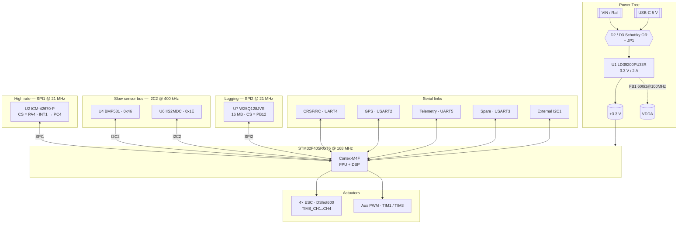

# MiniTULPAR — Custom Flight Controller Board (FCB)

> A quadcopter flight controller designed from scratch around the STM32F405.
> Schematic, 4-layer PCB, power architecture, sensor integration and firmware
> all live in this repository — no existing open-source flight controller is
> used.

<p align="left">
  
  
  
  
  
</p>

---

## ⚠️ Project Status

This project is **under active development**. The table below shows what is
finished and what is still in progress:

| Component | Status | Notes |
|---|---|---|
| Schematic design | ✅ Rev A complete | `MiniTulpar_Schematic.pdf` |
| PCB layout (4 layer) | ✅ Complete | 53.6 × 53.6 mm, 1.6 mm |
| Manufacturing files (Gerber/BOM/CPL) | ✅ Generated | `mfr/` |
| System architecture documentation | ✅ Complete | `docs/architecture.md` |
| Pin configuration (CubeMX) | ✅ Verified | No timer channel conflicts |
| Clock tree configuration | ✅ Verified | 168 MHz SYSCLK, 48 MHz USB |
| Board fabrication and assembly | 🔄 Planned | — |
| **Firmware** | 🚧 **In development — not started** | See the roadmap below |
| Flight testing | ⏳ Blocked | Depends on firmware |
| Lower-cost board variants | 🔄 Planned | See [Planned Variants](#planned-variants) |

> **Firmware note:** the firmware is **in development**. Nothing described in
> the roadmap below has been implemented yet — drivers, sensor fusion, PID
> control and the safety layer are all still to be written. The architectural
> decisions behind them (bus allocation, timer/DMA assignments, interrupt
> priorities) are documented in advance in `docs/architecture.md`, and
> development will follow that document. **The board does not fly in its
> current state.**

---

## Table of Contents

- [Project Goal](#project-goal)
- [Hardware Overview](#hardware-overview)
- [System Architecture](#system-architecture)
- [Bus Allocation and Rationale](#bus-allocation-and-rationale)
- [Timer and DMA Allocation](#timer-and-dma-allocation)
- [Pin Map](#pin-map)
- [Clock Configuration](#clock-configuration)
- [Firmware Roadmap](#firmware-roadmap)
- [Planned Variants](#planned-variants)
- [Repository Layout](#repository-layout)
- [Development Environment](#development-environment)
- [Known Issues and Rev B Notes](#known-issues-and-rev-b-notes)
- [License](#license)

---

## Project Goal

The goal is to **design, understand and implement every hardware and software
component** rather than buying an off-the-shelf flight controller (Betaflight /
ArduPilot hardware). That includes:

- Multi-layer PCB design and power architecture
- Writing IMU / barometer / magnetometer drivers from scratch
- Sensor fusion (Mahony / Madgwick / EKF)
- PID-based stabilisation and mixing
- Generating the DShot ESC protocol directly from timers and DMA
- GPS, telemetry, blackbox logging and the failsafe/safety layer

Every design decision is recorded in `docs/architecture.md` together with the
alternative that was rejected and the reason it was rejected.

---

## Hardware Overview

| Feature | Value |
|---|---|
| MCU | **STM32F405RGT6** — Cortex-M4F, 168 MHz, 1 MB Flash, 192 KB RAM (128 KB SRAM + 64 KB CCM) |
| Oscillator | 8 MHz HSE (ECS-80-10-30B-CKM-TR) |
| PCB | 4 layer, 53.6 × 53.6 mm, 1.6 mm thickness |
| Power | USB-C 5 V ↔ VIN, Schottky OR (D2/D3) + JP1 jumper → **LD39200PU33R** 3.3 V / 2 A LDO |
| IMU | **ICM-42670-P** (accel + gyro) — SPI1 @ 21 MHz, INT1 → PC4 |
| Barometer | **BMP581** — I2C2, 0x46, INT → PB1 |
| Magnetometer | **IIS2MDC** — I2C2, 0x1E, DRDY → PB2 |
| Blackbox flash | **W25Q128JVS** 16 MB — SPI2 @ 21 MHz |
| Motor outputs | 4× **DShot600** — TIM8_CH1..CH4 (PC6–PC9), single DMA burst |
| Auxiliary PWM | TIM1_CH1/CH3 (PA8/PA10) + TIM3_CH1/CH2 (PB4/PB5 — camera gimbal) |
| RC input | CRSF / ELRS — UART4 (J10) |
| GPS | USART2 (J12) |
| Telemetry | UART5 (J11) |
| Spare UART | USART3 (J5) |
| External I²C | I2C1 (J6) — separate from the internal sensor bus |
| ADC | Battery voltage → PC3 (ADC1_IN13), external → PC2 (ADC1_IN12) |
| USB | USB-C 2.0, USBLC6-2SC6 ESD protection + polyfuse + 5.1 kΩ CC |
| Debug | 10-pin 1.27 mm SWD (J13) |
| LEDs | 3× status LEDs + power LED |

---

## System Architecture



**The critical data path:** the IMU's INT1 line raises an EXTI interrupt → a
SPI1 DMA burst read starts → the DMA completion interrupt runs the filter, PID
and mixer chain → the result is encoded into a DShot frame and handed to the
TIM8 DMA. The whole chain completes **inside one interrupt context**, never
waiting on any other peripheral.

---

## Bus Allocation and Rationale

The founding principle of the architecture:

> **The critical path lives on SPI. Everything non-critical lives on I²C.**

| Device | Bus | Speed | Why |
|---|---|---|---|
| ICM-42670-P | **SPI1** (alone) | 21 MHz | The only high-rate path; the same read takes ~68× longer on I²C |
| BMP581 + IIS2MDC | **I2C2** (shared) | 400 kHz | ~4 % combined bus load; neither is on the critical path |
| W25Q128JVS | **SPI2** (alone) | 21 MHz | A sector erase can take 400 ms and must never delay a gyro read |
| External devices | **I2C1** | 400 kHz | A cable means ESD, capacitance and lockup risk — isolated from the internal sensors |

**Why the IMU is on SPI.** A 15-byte sample read takes ~5.7 µs on SPI1 versus
~388 µs on I²C Fast-mode:

| Loop rate | SPI load | I²C load |
|---|---|---|
| 1 kHz | 0.6 % | 39 % |
| 1.6 kHz | 0.9 % | 62 % |
| 4 kHz | 2.3 % | impossible |

Beyond bandwidth: SPI is deterministic (no clock stretching), has no bus-lockup
failure mode, survives the noisy environment of ESCs switching at 20–40 kHz
thanks to its push-pull drivers, and costs the CPU nothing when paired with DMA.

---

## Timer and DMA Allocation

### Timer assignment

The current CubeMX pin configuration is **conflict-free** — all four motor
outputs, both auxiliary PWM channels and both gimbal channels are usable at the
same time:

| Function | Timer | Channel | Pin | Timer clock |
|---|---|---|---|---|
| Motor 1–4 | **TIM8** | CH1–CH4 | PC6 / PC7 / PC8 / PC9 | 168 MHz (APB2) |
| Aux PWM 1–2 | TIM1 | CH1 / CH3 | PA8 / PA10 | 168 MHz (APB2) |
| Camera gimbal 1–2 | TIM3 | CH2 / CH1 | PB5 / PB4 | 84 MHz (APB1) |

The motors are on **TIM8** rather than TIM3 for four reasons:

1. TIM3_CH1 can be routed to either PC6 or PB4, but only one at a time — putting
   the motors on TIM8 leaves TIM3 entirely free for the gimbal outputs.
2. TIM8 sits on APB2, so its timer clock is 168 MHz (twice TIM3's) — twice the
   DShot bit-timing resolution.
3. TIM8 is an advanced-control timer: its break input can drive a hardware motor
   cutoff for failsafe later.
4. All four motors on one timer are bit-synchronous and need only a single DMA
   burst (TIM8_UP + DMAR).

Because the two gimbal channels sit on TIM3 (84 MHz) and the aux PWM channels on
TIM1 (168 MHz), driving both at a common servo rate means programming the two
timers separately with different prescaler values.

### DShot600 timing (TIM8 @ 168 MHz)

| Protocol | ARR | CCR for "0" | CCR for "1" | Frame |
|---|---|---|---|---|
| DShot300 | 559 | 210 | 420 | 53.3 µs |
| **DShot600** | **279** | **105** | **210** | **26.7 µs** |

DShot is digital: **ESC calibration stops being a step that exists**, and every
frame carries a 4-bit CRC — a command corrupted by noise is discarded by the ESC
instead of silently applying the wrong throttle.

### DMA assignments (under the RM0090 Table 42/43 constraints)

**DMA2**

| Stream | Ch | Assignment |
|---|---|---|
| S0 | 3 | SPI1_RX — IMU read *(the critical path)* |
| S1 | 7 | TIM8_UP — DShot burst output |
| S5 | 3 | SPI1_TX — IMU command |
| S2/S3/S4/S7 | 7 | *Reserved:* bidirectional DShot (unused in v1) |

**DMA1**

| Stream | Ch | Assignment |
|---|---|---|
| S0 | 4 | UART5_RX — telemetry |
| S1 | 4 | USART3_RX — spare |
| S2 | 4 | UART4_RX — CRSF/RC *(420 kbaud, critical)* |
| S3 | 0 | SPI2_RX — flash |
| S4 | 0 | SPI2_TX — blackbox |
| S5 | 4 | USART2_RX — GPS (circular + IDLE) |
| S6 | 4 | USART2_TX — GPS configuration |
| S7 | 4 | UART5_TX — telemetry |

I2C1/I2C2, UART4_TX, USART3_TX and ADC1 are interrupt-driven — their streams
went to higher-value work and their load is negligible.

### Interrupt priorities (NVIC)

| Priority | Interrupt |
|---|---|
| 0 | EXTI4 — IMU INT1 (timestamps the sampling instant) |
| 1 | DMA2_S0 — SPI1_RX complete (triggers the control chain) |
| 2 | DMA2_S1 — TIM8_UP (motor frame) |
| 3 | DMA1_S2 — UART4_RX (RC / failsafe) |
| 4 | DMA1_S5 — USART2_RX (GPS) |
| 5 | I2C2_EV / I2C2_ER |
| 6 | SysTick |
| 7 | Flash, UART5, USB |

> **The rule:** blackbox writes, USB and telemetry must **never** preempt the
> control loop.

### Target timing budget (1 kHz loop)

| Step | Duration | Occupies the CPU? |
|---|---|---|
| IMU SPI burst read | 5.7 µs | No (DMA) |
| Filtering (3× biquad + PT1) | ~10 µs | Yes |
| Attitude update (Mahony) | ~20 µs | Yes |
| PID (3 axes) | ~12 µs | Yes |
| Mixer + motor limiting | ~4 µs | Yes |
| DShot frame encoding | ~6 µs | Yes |
| **Total CPU** | **~52 µs** | **≈ 5 % load** |

---

## Pin Map

This table is the single source of truth for the pin map — it is never
maintained in two places.

| Port | Signal | Function |
|---|---|---|
| PA4 / PA5 / PA6 / PA7 | SPI1 CS/SCK/MISO/MOSI | IMU |
| PC4 | INT_IMU1 | EXTI4 — data ready |
| PB12 / PB13 / PB14 / PB15 | SPI2 CS/SCK/MISO/MOSI | Blackbox flash |
| PB10 / PB11 | I2C2 SCL/SDA | Internal sensor bus |
| PB1 / PB2 | INT_BAR / INT_MAG | EXTI1 / EXTI2 |
| PB8 / PB9 | I2C1 SCL/SDA | External connector (J6) |
| PC6 / PC7 / PC8 / PC9 | DSHOT_1..4 | **TIM8_CH1..CH4** |
| PA8 / PA10 | Aux PWM 1–2 | TIM1_CH1 / TIM1_CH3 |
| PB4 / PB5 | CAM_GIMBAL2 / CAM_GIMBAL1 | TIM3_CH1 / TIM3_CH2 |
| PA0 / PA1 | UART4 TX/RX | CRSF / RC (J10) |
| PA2 / PA3 | USART2 TX/RX | GPS (J12) |
| PC12 / PD2 | UART5 TX/RX | Telemetry (J11) |
| PC10 / PC11 | USART3 TX/RX | Spare (J5) |
| PC2 / PC3 | ADC1_IN12 / ADC1_IN13 | External ADC / battery |
| PA11 / PA12 / PA9 | USB DM/DP/VBUS | USB-C |
| PA13 / PA14 | SWDIO / SWCLK | SWD (J13) |
| PC13 / PC14 / PC15 | LD1 / LD2 / LD3 | Status LEDs |
| PH0 / PH1 | HSE IN/OUT | 8 MHz crystal |

**Unused and available:** PA15, PB0, PB3, PB6, PB7, PC0, PC1, PC5.
PB6/PB7 = USART1, PB0/PB1 = TIM3_CH3/CH4, and PB0 + PC5 together are exactly the
chip select + interrupt pair a second IMU would need.

Full pin table including physical pin numbers: [`docs/architecture.md`](docs/architecture.md)

---

## Clock Configuration

8 MHz HSE crystal → PLL (M = 4, N = 168, P = 2) → **168 MHz SYSCLK**, with the
PLL Q divider set to 7 for the 48 MHz USB clock. CSS (clock security system) is
enabled, so a crystal failure falls back to the HSI instead of stopping the
core.

| Domain | Prescaler | Frequency |
|---|---|---|
| SYSCLK / HCLK (AHB, core, memory, DMA) | /1 | **168 MHz** |
| APB1 peripheral clock (PCLK1) | /4 | 42 MHz |
| APB1 timer clock (TIM3 …) | — | 84 MHz |
| APB2 peripheral clock (PCLK2) | /2 | 84 MHz |
| APB2 timer clock (**TIM1, TIM8**) | — | **168 MHz** |
| USB OTG FS | PLL /Q = 7 | 48 MHz |
| IWDG | LSI | 32 kHz |

The RTC runs from the internal LSI — no LSE crystal is fitted, because PC14/PC15
are used as status LED outputs. This is irrelevant for a flight controller.

SPI1 and SPI2 both run at 21 MHz: SPI1 from PCLK2 (84 MHz ÷ 4) and SPI2 from
PCLK1 (42 MHz ÷ 2), both comfortably under the ICM-42670-P's 24 MHz and the
W25Q128's 133 MHz limits.

---

## Firmware Roadmap

> 🚧 **Nothing in this section has been implemented yet.** The order is chosen to
> minimise bring-up risk; each step depends on the previous one being verified.

### Stage 0 — Bring-up
- [ ] Project skeleton and build system
- [ ] SWD connection and LED blink — is the board alive?
- [ ] Bring up the clock tree on hardware and measure it (8 MHz HSE → 168 MHz)
- [ ] Generate the pin configuration from the pin map above
- [ ] Debug console over USB CDC

### Stage 1 — Sensors
- [ ] SPI1 + DMA driver, ICM-42670-P WHO_AM_I
- [ ] Raw IMU reads (INT1 → EXTI → DMA burst chain)
- [ ] IMU internal UI filter / ODR configuration *(anti-aliasing is critical)*
- [ ] I2C2 as a **non-blocking state machine** + timeouts + bus recovery (9× SCL)
- [ ] BMP581 driver (pressure → altitude)
- [ ] IIS2MDC driver + hard/soft-iron calibration
- [ ] Gyro/accel calibration and temperature compensation

### Stage 2 — Actuators
- [ ] DShot600 frame generation via TIM8 + DMAR burst
- [ ] Motor test mode — **props off**, verify frames on a scope
- [ ] Mixer (quad X), motor limiting / airmode

### Stage 3 — Control
- [ ] Gyro filter chain (biquad LPF + notch + PT1)
- [ ] Attitude estimation — Mahony (EKF later)
- [ ] Rate PID loop (acro mode)
- [ ] Angle/horizon loop (self-level)
- [ ] PID gain tuning interface

### Stage 4 — RC and safety
- [ ] CRSF parser (UART4 DMA + IDLE line)
- [ ] Arming/disarming state machine + sensor health check
- [ ] **IWDG** (~50 ms, fed only by the main control loop)
- [ ] Gyro timeout → immediate disarm
- [ ] RC timeout (~500 ms) → progressive throttle-cut failsafe
- [ ] Battery voltage monitoring + low-voltage warning

### Stage 5 — Navigation and logging
- [ ] GPS UBX/NMEA parser (USART2 DMA)
- [ ] Blackbox logging (SPI2 → W25Q128, pre-erase while idle)
- [ ] Telemetry (UART5) and the CRSF back-channel
- [ ] Altitude hold → position hold → return-to-home

### Stage 6 — Advanced
- [ ] Bidirectional DShot (RPM telemetry) + RPM-based notch filtering
- [ ] EKF-based sensor fusion
- [ ] Host-side unit tests (HIL/SIL)

**The safety layer is non-negotiable:** motors are **always** disarmed at
power-up; arming requires low throttle plus an explicit arm command plus a
sensor health check.

---

## Planned Variants

MiniTULPAR Rev A is the reference design — it is deliberately built with
good parts rather than cheap ones, so that when something misbehaves the cause
is the design and not the bill of materials.

**More affordable versions of this board will be added later.** The plan is to
publish lower-cost variants alongside the reference design, so the project stays
buildable on a smaller budget:

- Cheaper sensor options (a lower-cost IMU and barometer in place of the
  ICM-42670-P / BMP581)
- A reduced-feature build — dropping the blackbox flash, the magnetometer or the
  gimbal outputs where they are not needed
- A 2-layer variant to cut fabrication cost
- Widely stocked, low-cost alternatives for the passives, connectors and the
  regulator
- Where a substitution changes the firmware, the difference will be documented
  rather than hidden behind a build flag

Each variant will ship with its own BOM and a short note on what was traded
away. The reference design stays the one that is documented and tested first.

---

## Repository Layout

Hardware and firmware live in a **single repository** (monorepo) — when a pin
changes, KiCad, the documentation and the firmware are all updated in the same
commit.

```
custom-fcb/
├── README.md
├── docs/                    architecture, power tree, pinout, BOM, test plan
│   ├── architecture.md      design decisions and their rationale (EN)
│   ├── mimari.md            the same document (TR)
│   └── images/
├── hardware/
│   ├── MiniTULPAR.kicad_pro / .kicad_sch / .kicad_pcb
│   ├── libs/                custom symbol + footprint libraries
│   ├── datasheets/
│   └── production/          Gerber / drill / BOM / CPL — gitignored
└── firmware/                🚧 in development — nothing implemented yet
    ├── drivers/             imu, baro, mag, gps, crsf, esc/dshot
    ├── fusion/              mahony / madgwick / ekf
    ├── control/             pid, rate and angle loops, mixer
    ├── telemetry/
    ├── safety/              failsafe, arming, watchdog
    └── tests/               host-side unit tests
```

**Version control rules**

- `hardware/production/` is gitignored. Gerbers are added by hand only when a
  board is ordered, together with `git tag hw-vX.Y` — so it is always certain
  which board was built from which files.
- Flight logs (`logs/`, `*.bbl`) never enter the repository.
- `.gitattributes` normalises line endings to LF in the repository.

---

## Development Environment

**Hardware side**

| Tool | Version / note |
|---|---|
| KiCad | 8.x |
| Schematic | `MiniTULPAR.kicad_sch` (+ `scheme_diagram.kicad_sch`) |
| Custom footprints | `ftp.pretty/` |
| Custom symbols | `MiniTULPAR_sym.kicad_sym` |

**Firmware side** *(planned)*

| Tool | Note |
|---|---|
| Toolchain | `arm-none-eabi-gcc` |
| Build | CMake + Ninja |
| Peripheral layer | STM32CubeF4 (mostly LL; register level on the critical path) |
| Pin & clock configuration | STM32CubeMX |
| Debug | ST-Link / J-Link + OpenOCD, SWO trace |
| Measurement | Loop-time profiling with the DWT cycle counter |

**Ordering a board**

```powershell
git tag -a hw-v0.1 -m "First board order"
git push --tags
gh release create hw-v0.1 hardware\production\*.zip
```

---

## Known Issues and Rev B Notes

Findings from the schematic review. **None of them makes the board
non-functional**, but they should be decided before fabrication.

| # | Issue | Status / recommendation |
|---|---|---|
| 1 | **ICM-42670-P ODR ceiling of 1.6 kHz** — this is the low-power member of the family, not the ICM-42688-P. An 8 kHz loop is **not possible** on this board (sensor-limited, not bus-limited). | Target a **1 kHz PID loop**. Because of the aliasing risk, the internal UI filter must be configured deliberately and the IMU soft-mounted. |
| 2 | **External I²C pull-ups** — I2C1 (R5/R6) is 4.7 kΩ; with cable capacitance the 300 ns rise-time budget is exceeded. | **Drop to 2.2 kΩ** (allows ~160 pF, sink current 1.5 mA). |
| 3 | **No SBUS support** — the STM32F405's UARTs have no hardware signal inversion. | Fine for CRSF/ELRS. If SBUS is wanted, an external inverter (74LVC1G04) has to be added. |
| 4 | **The battery divider is off-board**, with no overvoltage protection. | Rev B: 1 kΩ series into PC3 plus a Schottky clamp to 3.3 V. |
| 5 | **Magnetometer placement** — the on-board IIS2MDC is affected by the field the motor currents produce. | Use the GPS module's compass on J6 as the primary and keep the IIS2MDC as a backup. Place it as far from the power section as the layout allows. |
| 6 | **LDO thermal budget** — 0.85 W at 500 mA with 5 V in. J5/J6/J7/J10/J11/J12 all supply 3.3 V, and a GPS module alone can draw 100–150 mA. | Thermal via array under the LDO; the load budget belongs in `docs/power-tree.md`. |
| 7 | **DShot pins after reset** are high-impedance. | Confirm the ESCs do not apply throttle in that state; add pull-downs on the motor lines if they do (Rev B). |

---

## License

**BSD 3-Clause License** — Copyright © 2026 Erdem Hatayoğlu.

One licence covers the whole repository: firmware, hardware design files and
documentation. It is permissive — you may use, modify and redistribute this
work in source and binary form, including commercially and in closed-source
products, provided that:

- the copyright notice, the list of conditions and the disclaimer are retained
- neither the project name nor the author's name is used to endorse or promote
  derived products without prior written permission

The work comes with no warranty of any kind. Full text: [`LICENSE`](LICENSE)

New files should carry an SPDX header so each file's licence is unambiguous:

```
SPDX-License-Identifier: BSD-3-Clause
SPDX-FileCopyrightText: 2026 Erdem Hatayoğlu
```

Third-party files (vendor headers, generated peripheral libraries, imported
footprints) keep the licence of their original author; where such a file carries
its own licence header, that header takes precedence.

---

## Disclaimer

This board and its firmware are **in development and untested**. Spinning
propellers can cause serious injury. Always run motor tests **with the
propellers removed**, perform the first closed-loop attempts on a safe test
bench, and verify the arming and failsafe logic before flying. Use this project
entirely at your own risk.
