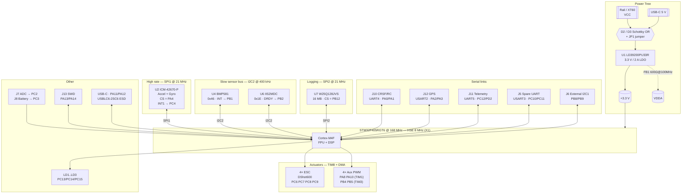

# MiniTULPAR — System Architecture and Design Rationale

**Board:** MiniTULPAR FCB · **Schematic revision:** Rev A, 2026-08-10
**MCU:** STM32F405RGT6 (LQFP64, 168 MHz, 1 MB Flash, 192 KB RAM)
**Document status:** Reverse-engineered from the Rev A schematic; firmware decisions are proposals.
**Location:** `docs/architecture.md`

> This document does not record *what* was built — it records **why it was built
> this way**. Every decision lists the alternative that was rejected and the
> reason it was rejected. When the board is revised, this document gets revised
> too. If the schematic and this document ever disagree, **the schematic is
> right and this document is wrong** — fix the document.

---

## 0. Executive summary — the architecture in three sentences

A single ICM-42670-P IMU sits alone on **SPI1** and is sampled on a data-ready
interrupt; this is the only high-rate path on the board and it gets its own bus.
Slow sensors — barometer and magnetometer — share **I2C2**, because their
sampling rates cannot stress the bus and sharing buys back pins. All four motors
are driven from **TIM8** over DShot through a single DMA stream (TIM8_UP with
DMAR burst), and everything else flows through UART/DMA pairs that never touch
the CPU.

---

## 1. Block diagram



**How data actually flows:** the IMU's INT1 line raises an EXTI interrupt → a
SPI1 DMA burst read starts → the DMA completion interrupt runs the filter, PID
and mixer chain → the result is encoded into a DShot frame and handed to the
TIM8 DMA. The whole chain completes **inside one interrupt context**, never
waiting on any other peripheral. Everything else — baro, mag, GPS, telemetry,
logging — runs outside that chain at lower priority.

---

## 2. Bus allocation and rationale

### 2.1 Summary

| Sensor / device | Bus | Clock | Sample rate | Why this bus |
|---|---|---|---|---|
| ICM-42670-P (accel/gyro) | **SPI1** | 21 MHz | up to 1.6 kHz | The only high-rate path; I²C bandwidth does not fit (§2.2) |
| BMP581 (baro) | **I2C2** | 400 kHz | ~50–100 Hz | Slow; saves pins; not worth occupying an SPI |
| IIS2MDC (mag) | **I2C2** | 400 kHz | 100 Hz | Same; I²C is also the part's native interface |
| W25Q128JVS (log) | **SPI2** | 21 MHz | continuous block writes | Must not share a bus with the IMU (§2.4) |
| CRSF / RC | UART4 | 420 kbaud | 250–500 Hz packets | Framed protocol; DMA + IDLE line costs zero CPU |
| GPS | USART2 | 115200 | 5–10 Hz | Same |
| Telemetry | UART5 | 57600–115200 | ~10 Hz | Same |
| Spare | USART3 | — | — | ESC telemetry / VTX / future use |
| External I²C | I2C1 | 400 kHz | ≤100 Hz | Leaves the board on a cable — kept **separate** from the internal bus (§2.5) |

### 2.2 DECISION: the IMU goes on **SPI1**, not on I²C

**Decision:** the ICM-42670-P sits alone on SPI1 with a dedicated chip select
(PA4).

**Rationale — the numbers.** One sample read is 1 register address byte + 14
data bytes (TEMP 2 + GYRO 6 + ACCEL 6) = 15 bytes.

*On SPI1 (APB2 = 84 MHz, prescaler /4 → 21 MHz, below the ICM-42670-P's 24 MHz
limit):*

```
15 bytes × 8 bits = 120 bits
120 bits ÷ 21 MHz  ≈  5.7 µs
```

*The same read over I²C (Fast-mode, 400 kHz):*

```
START + ADDR_W(9) + REG(9) + REPEATED START + ADDR_R(9) + 14×9 bits + STOP
= 9 + 9 + 9 + 126  ≈  155 bit-times  (plus start/stop overhead)
155 ÷ 400 kHz  ≈  388 µs
```

**The same work takes roughly 68× longer on I²C.** What that costs:

| Loop rate | Period | SPI load | I²C load |
|---|---|---|---|
| 1 kHz | 1000 µs | 0.6 % | **39 %** |
| 1.6 kHz (the part's ceiling) | 625 µs | 0.9 % | **62 %** |
| 4 kHz | 250 µs | 2.3 % | **impossible** |
| 8 kHz | 125 µs | 4.6 % | **impossible** |

Because 388 µs > 125 µs, 8 kHz sampling physically does not fit on I²C — a
single read consumes three times the whole period. At 1.6 kHz it technically
"fits", but handing 62 % of a bus to one sensor means nothing else can ever
share that bus. And there is no escape upward: the STM32F405's I²C peripheral
**cannot exceed 400 kHz** — there is no Fast-mode Plus on this part.

**The reasons that have nothing to do with bandwidth — these matter just as
much:**

1. **Determinism.** An SPI transfer takes a fixed, predictable time. On I²C a
   slave may apply **clock stretching**, so the transfer takes as long as the
   slave feels like. Jitter in the control loop period shows up directly as
   noise on the derivative term.
2. **Bus lockup.** I²C is open-drain. If a slave resets at the wrong moment it
   can hold SDA low and **wedge the entire bus**. Recovery means manually
   clocking out nine SCL pulses — not something to be doing mid-flight. SPI has
   no equivalent failure mode; deasserting CS resynchronises the device.
3. **Noise immunity.** The ESCs switch tens of amps at 20–40 kHz. I²C's slow,
   pull-up-driven rising edges are vulnerable in that environment; SPI's
   push-pull drivers are far more robust.
4. **STM32F4 I²C errata.** The F4 family's I²C peripheral has documented errata,
   including a BUSY flag that can latch under specific conditions. The
   flight-critical path should not be built on that peripheral.
5. **DMA friendliness.** SPI + DMA moves 15 bytes at **zero** CPU cost. I²C +
   DMA works on the F4, but the START/ADDR/RESTART phases still need interrupt
   servicing — it is not free.

**Rejected alternatives:**

- *IMU on I²C* — see the table above. This would be reasonable for a 100 Hz tilt
  sensor. It is not reasonable for a flight controller.
- *Sharing one SPI between the IMU and the flash* — see §2.4.
- *Polling instead of using the INT line* — the delay between the sampling
  instant and the read instant becomes variable, which is a timestamp error in
  the fusion filter. This is exactly why INT1 is routed to PC4, and it
  **must be used**.

### 2.3 DECISION: barometer and magnetometer share **I2C2**

**Decision:** BMP581 (0x46) and IIS2MDC (0x1E) share I2C2 on PB10/PB11.

**Rationale.** The physics of these sensors is already slow.

- Barometer: altitude estimation gains nothing above 50–100 Hz — measurement
  noise and the sensor's own conversion time dominate.
- Magnetometer: the IIS2MDC tops out at 100 Hz ODR, so reading faster buys
  nothing.

Load calculation, with both sensors reading 6 bytes at 100 Hz:

```
6-byte read ≈ 9 + 9 + 9 + 54 = 81 bit-times ≈ 203 µs @ 400 kHz
2 sensors × 100 Hz × 203 µs = 40.6 ms/s  →  bus load ≈ 4 %
```

Four percent load, ninety-six percent idle. Moving these to SPI would spend two
more chip-select pins and gain nothing. **I²C's weaknesses — indeterminate
timing, lockup risk — are acceptable here**, because neither sensor is on the
critical path of the stabilisation loop. If the baro or mag stalls for a few
periods, or dies outright, the quad keeps flying with degraded altitude and
heading. If the gyro stalls, it falls. That asymmetry is the whole basis of the
split:

> **The critical path lives on SPI. Everything non-critical lives on I²C.**

**The obligation this puts on firmware:** the I2C2 driver must be written as a
**non-blocking state machine**, every transfer must have a timeout, and a
timeout must trigger the bus recovery routine (nine SCL pulses followed by a
STOP). A failure of these two sensors must never stall the main loop.

### 2.4 DECISION: flash on its own bus (SPI2), not shared with the IMU

**Decision:** the W25Q128JVS gets SPI2 (PB12–PB15) to itself.

**Rationale.** Blackbox logging writes **long and unpredictable** blocks by
nature:

| Operation | Duration (W25Q128JV typ / max) |
|---|---|
| 256-byte page program | 0.7 ms / 3 ms |
| 4 KB sector erase | 45 ms / 400 ms |

A sector erase can take **up to 400 ms**. If the flash shared a bus with the
IMU, a gyro read would sit behind that queue — or the firmware would need
elaborate transfer-splitting and priority logic. Two separate SPIs make the
problem disappear at design time: **no shared resource, no priority problem.**

Bandwidth check: at 1 kHz with ~60 bytes per record, logging produces 60 kB/s.
The flash sustains 256 B / 0.7 ms ≈ 365 kB/s — comfortable margin. The real
constraint is erase time:

```
Worst case: 400 ms erase × 60 kB/s = 24 KB of RAM buffering required
```

The F405's 192 KB (128 KB SRAM + 64 KB CCM) covers that easily, but **the buffer
size should not be left to chance**. The better approach is to erase ahead
during idle time — erase the next blocks before arming — so that only page
programs happen in flight and the required buffer drops to 3 ms × 60 kB/s ≈
200 bytes.

### 2.5 DECISION: two separate I²C buses — internal (I2C2) and external (I2C1)

**Decision:** on-board sensors on I2C2; the off-board J6 connector on its own
bus, I2C1 (PB8/PB9).

**Rationale.** The external bus leaves the board on a cable, which brings three
distinct risks:

1. **ESD and shorts.** A reversed connector or a chafed cable takes down
   everything on that bus. Isolating the internal baro and mag means one cable
   fault cannot kill altitude estimation.
2. **Lockup isolation.** If an external device — a GPS module's compass, say —
   holds SDA low and wedges its bus, the internal sensors are untouched.
3. **Capacitance and edge rates.** A cable adds roughly 50–100 pF per metre. On
   a shared bus that would degrade the internal sensors' edges too.

**A concrete finding that falls out of this:** the schematic pulls both buses up
with 4.7 kΩ (I2C1: R5/R6, I2C2: R3/R4). Fast-mode allows a maximum rise time of
300 ns:

```
t_r ≈ 0.8473 × R × C   →   C_max = 300 ns / (0.8473 × 4700 Ω) ≈ 75 pF
```

The internal bus — two devices, short traces — lands around 20–40 pF, so
**4.7 kΩ is fine there**. On the external bus, even 30 cm of cable adds 30–50 pF,
and together with the remote module the 75 pF budget is **exceeded**.
Recommendation: **drop the I2C1 pull-ups to 2.2 kΩ** (R5/R6). That allows about
160 pF instead of 75 pF, and the sink current stays at 3.3 V / 2.2 kΩ = 1.5 mA,
well under the 3 mA I²C limit.

---

## 3. Timer and DMA allocation

### 3.1 ⚠ Resolve this first: a TIM3 channel conflict

The schematic uses these pins:

| Net | Pin | Possible timer channels |
|---|---|---|
| DSHOT_1 | PC6 | TIM3_CH1 · **TIM8_CH1** |
| DSHOT_2 | PC7 | TIM3_CH2 · **TIM8_CH2** |
| DSHOT_3 | PC8 | TIM3_CH3 · **TIM8_CH3** |
| DSHOT_4 | PC9 | TIM3_CH4 · **TIM8_CH4** |
| PWM_3 | PB4 | **TIM3_CH1** |
| PWM_4 | PB5 | **TIM3_CH2** |
| PWM_1 | PA8 | **TIM1_CH1** |
| PWM_2 | PA10 | **TIM1_CH3** |

**The problem:** PB4 and PC6 are two alternate pins for the *same* channel,
TIM3_CH1. A timer channel can be routed to **one pin at a time**. Assign DShot
to TIM3 and PWM_3/PWM_4 go dead; assign PWM to TIM3 and DSHOT_1/DSHOT_2 go dead.

**Resolution — no hardware change needed, this is purely a firmware decision:**

| Function | Timer | Channel | Pin | Timer clock |
|---|---|---|---|---|
| Motor 1 | **TIM8** | CH1 | PC6 | 168 MHz (APB2) |
| Motor 2 | **TIM8** | CH2 | PC7 | 168 MHz |
| Motor 3 | **TIM8** | CH3 | PC8 | 168 MHz |
| Motor 4 | **TIM8** | CH4 | PC9 | 168 MHz |
| Aux PWM 1 | TIM1 | CH1 | PA8 | 168 MHz |
| Aux PWM 2 | TIM1 | CH3 | PA10 | 168 MHz |
| Aux PWM 3 | TIM3 | CH1 | PB4 | 84 MHz (APB1) |
| Aux PWM 4 | TIM3 | CH2 | PB5 | 84 MHz |

**Why TIM8 rather than TIM3:**

1. It resolves the conflict — all four aux PWM channels stay usable.
2. TIM8 lives on APB2, so its timer clock is **168 MHz** (TIM3 is on APB1 at
   84 MHz). That is twice the resolution for DShot bit timing (§3.2).
3. TIM8 is an advanced-control timer: it has dead-time generation, a break input
   and a repetition counter. The break input is a path to hardware motor cutoff
   for failsafe later; TIM3 has none of this.
4. All four motors on **one timer** means they are bit-synchronous, and one DMA
   stream (TIM8_UP + DMAR burst) drives all of them.

**Note:** since two aux PWM channels are on TIM1 and two on TIM3, driving servos
means programming both timers to the same period (e.g. 50 Hz / 20 ms, or
333 Hz) separately — and the prescaler values will differ, because one runs at
168 MHz and the other at 84 MHz.

### 3.2 DShot timing numbers (TIM8 @ 168 MHz)

DShot encodes a bit by pulse width: high for **37.5 %** of the bit period is a
"0", high for **75 %** is a "1". In PWM mode the CCR value changes per bit.

| Protocol | Bit rate | ARR | CCR for "0" | CCR for "1" | 16-bit frame |
|---|---|---|---|---|---|
| DShot150 | 150 kbit/s | 1119 | 420 | 840 | 107 µs |
| DShot300 | 300 kbit/s | 559 | 210 | 420 | 53.3 µs |
| **DShot600** | 600 kbit/s | **279** | **105** | **210** | **26.7 µs** |
| DShot1200 | 1200 kbit/s | 139 | 52 | 105 | 13.3 µs |

```
ARR = (168 MHz / bit_rate) − 1        →  168e6 / 600e3 − 1 = 279
CCR_0 = 0.375 × 280 = 105
CCR_1 = 0.750 × 280 = 210
```

**Recommendation: DShot600.** A 26.7 µs frame is 2.7 % of a 1 kHz period, 4.3 %
at 1.6 kHz. DShot1200 is fussy about cable length and ESC compatibility and buys
nothing here. DShot300 is a more forgiving first target; move to 600 once the
board is proven.

**Bidirectional DShot (RPM telemetry)**, if added later: the same pin is turned
into an input roughly 30 µs after the frame is sent, and the ESC's 21-bit GCR
response is read by input capture. That needs a separate DMA stream per channel
and changes the budget in §3.4 — handled there.

### 3.3 Why DShot rather than PWM or OneShot

| Protocol | Resolution | Frame | Calibration | CRC |
|---|---|---|---|---|
| PWM (1000–2000 µs) | ~1000 steps | 2 ms @ 500 Hz | Required | None |
| OneShot125 | ~1000 steps | 250 µs | Required | None |
| **DShot600** | **2048 steps** | **26.7 µs** | **Not needed** | **4-bit** |

DShot is digital: it does not depend on the ESC's interpretation of an analogue
pulse width, so **ESC calibration stops being a step that exists**. Every frame
carries a 4-bit CRC, so a command corrupted by noise gets discarded by the ESC
instead of silently applying the wrong throttle. On a noisy power board that
difference is a safety property, not a convenience.

### 3.4 DMA allocation

On the STM32F4, each peripheral request is hard-wired to **specific
stream + channel** combinations (RM0090 Tables 42/43). DMA allocation is
therefore not a free choice — it is a **constraint-satisfaction problem**. The
table below is a conflict-free solution under those constraints.

#### DMA2 (drives SPI1, TIM8, ADC1)

| Stream | Ch | Assignment | Why |
|---|---|---|---|
| **S0** | 3 | **SPI1_RX** — IMU read | The critical path. SPI1_RX exists only on S0C3 or S2C3 |
| **S1** | 7 | **TIM8_UP** — DShot burst output | The only option for TIM8_UP. DMAR writes CCR1–CCR4 in one go |
| **S2** | 7 | TIM8_CH1 (bidirectional DShot capture, M1) | Optional — §3.4.1 |
| **S3** | 7 | TIM8_CH2 (M2) | Optional |
| **S4** | 7 | TIM8_CH3 (M3) | Optional |
| **S5** | 3 | **SPI1_TX** — IMU command | SPI1_TX: S3C3 or S5C3. S3 was given to TIM8_CH2 |
| S6 | — | *free* | Reserve |
| **S7** | 7 | TIM8_CH4 (M4) | Optional |

#### DMA1 (drives SPI2, the UARTs, I²C)

| Stream | Ch | Assignment | Why |
|---|---|---|---|
| **S0** | 4 | **UART5_RX** — telemetry in | |
| **S1** | 4 | **USART3_RX** — spare UART | |
| **S2** | 4 | **UART4_RX** — CRSF / RC | **Critical.** 420 kbaud = 42 kB/s; interrupt-per-byte would mean 42 000 ISRs per second |
| **S3** | 0 | **SPI2_RX** — flash | |
| **S4** | 0 | **SPI2_TX** — flash / blackbox | Keeps long block writes off the CPU |
| **S5** | 4 | **USART2_RX** — GPS | Circular mode + IDLE line interrupt |
| **S6** | 4 | **USART2_TX** — GPS configuration (UBX) | |
| **S7** | 4 | **UART5_TX** — telemetry out | |

**What is left without DMA, and why:**

- **I2C1 and I2C2 → interrupt-driven.** I2C2_RX's options are S2C7 and S3C7, and
  both went to higher-value work (CRSF RX, flash RX). Acceptable: 6-byte
  transfers at 100 Hz produce ~1200 interrupts per second, about a thousandth of
  the CPU.
- **UART4_TX (CRSF telemetry back-channel) → interrupt.** Its S4C4 option
  collides with SPI2_TX. The back-channel is a few hundred bytes per second;
  interrupts are fine.
- **USART3_TX → interrupt.** Same reason (S3C4/S4C7 both collide).
- **ADC1 → interrupt or direct read.** ADC1's DMA options are DMA2 S0C0 and
  S4C0, both taken. Battery voltage and current are read at 100 Hz; a two-channel
  scan conversion serviced in an interrupt is negligible.

#### 3.4.1 The trade-off: bidirectional DShot or ADC DMA?

In the table above, DMA2 streams S2/S3/S4/S7 are reserved for bidirectional
DShot. **If bidirectional DShot is not used**, those four streams free up and
S0C0 or S4C0 opens for ADC1. The decision:

> **No bidirectional DShot on the first flight.** Run the ADC without DMA and
> leave the streams unused. RPM telemetry — for RPM-based notch filtering —
> comes later, in a separate firmware version, once basic flight is stable.

The reason: bidirectional DShot also requires support on the ESC side
(BLHeli_32 / AM32), GCR decoding is unpleasant to debug, and it muddies the
picture during bring-up. Get it flying first, then filter it.

### 3.5 Interrupt priority table (NVIC)

Allocating DMA and timers correctly is not enough; **which interrupt is allowed
to preempt which** is part of the architecture too. On Cortex-M4, lower number =
higher priority.

| Priority | Interrupt | Rationale |
|---|---|---|
| 0 | EXTI4 (PC4 — IMU INT1) | Timestamps the sampling instant. Any delay corrupts the timestamp |
| 1 | DMA2_Stream0 (SPI1_RX complete) | Triggers the control chain |
| 2 | DMA2_Stream1 (TIM8_UP) | Motor frame output |
| 3 | DMA1_Stream2 (UART4_RX — RC) | RC loss means failsafe; low tolerance for delay |
| 4 | DMA1_Stream5 (USART2_RX — GPS) | |
| 5 | I2C2_EV / I2C2_ER | Baro/mag; delay is harmless |
| 6 | SysTick | Timebase |
| 7 | DMA1_S3/S4 (flash), UART5, USB | None of these affect flight |

**The rule:** nothing runs at a higher priority than the interrupt that executes
the PID chain (priority 1). Blackbox writes, USB and telemetry must **never**
preempt the control loop.

---

## 4. Timing budget

The table below is an estimated budget for a 1 kHz control loop (1000 µs
period). These are targets — the real numbers should be measured with the DWT
cycle counter and written back into this table.

| Step | Duration | Occupies the CPU? |
|---|---|---|
| IMU SPI burst read | 5.7 µs | No (DMA) |
| Gyro/accel filtering (3× biquad + PT1) | ~10 µs | Yes |
| Attitude update (Mahony, 1 kHz) | ~20 µs | Yes |
| PID (3 axes, rate + angle) | ~12 µs | Yes |
| Mixer + motor limiting | ~4 µs | Yes |
| DShot frame encoding (4 channels × 16 bits) | ~6 µs | Yes |
| DShot600 frame transmission | 26.7 µs | No (DMA) |
| **Total CPU** | **~52 µs** | **5.2 % load** |

About 5 % core utilisation at 168 MHz leaves the remaining 95 % for the baro/mag
state machine, GPS parsing, telemetry, blackbox — and **margin for error**. That
margin is deliberate: the first firmware that actually works is always heavier
than the estimate.

---

## 5. Sampling architecture, and one critical warning

### 5.1 ⚠ The ICM-42670-P's ODR ceiling

**The ICM-42670-P's gyroscope output data rate is capped at 1.6 kHz.** This is
the low-power member of the family — it is *not* the same part as the
ICM-42688-P, which samples at 8 kHz / 32 kHz.

The architectural consequences:

1. **An 8 kHz control loop is not possible on this board** — not because of the
   bus, but because of the sensor. The SPI decision is still correct (I²C would
   eat 62 % of the bus even at 1.6 kHz), but the ceiling is set by the sensor.
2. **The realistic target is a 1 kHz PID loop**, with the gyro sampled at
   1.6 kHz ODR and passed through the internal filter. 1 kHz is more than enough
   to stabilise a quadcopter; 8 kHz is what you want for aggressive acro and
   RPM-based filtering.
3. **Anti-aliasing becomes critical.** A lower ODR increases the risk of motor
   vibration (typically a 100–500 Hz fundamental plus harmonics) folding into
   the passband. The ICM-42670-P's internal UI filter must be configured
   deliberately, and the IMU must be mechanically isolated with a soft mount.

**Recommendation:** target 1 kHz with this board — the architecture is sound and
the learning value is intact. If Rev B wants a higher loop rate, the
**ICM-42688-P** is the upgrade; it is in the same 14-pin LGA 2.5 × 3.0 mm class,
but the **pin map is not identical**, so the footprint and schematic must be
checked against the datasheet.

### 5.2 Interrupt-driven sampling, not polling

INT1 is routed to PC4 — use it:

```
IMU INT1 (PC4) → EXTI4 → start SPI1 DMA burst read
                          ↓
                 DMA2_S0 TC ISR → filter → PID → mixer → DShot DMA
```

This makes the delay between the sampling instant and the use of that data
**constant**. With periodic timer polling, the sensor's internal ODR clock and
the MCU clock drift against each other, so occasionally the same sample gets
read twice or one gets skipped — a silent and very hard-to-diagnose error source
in sensor fusion.

**INT2 (pin 9) is unconnected in the schematic.** It may be wanted later for a
FIFO watermark interrupt; for now one INT line is sufficient.

---

## 6. Findings from the schematic review

These came out of reading Rev A. None of them makes the board non-functional,
but the first three should be **decided before the board is ordered**.

### 6.1 The block diagram sheet disagrees with the schematic

Sheet 1 (block diagram) and sheet 2 (schematic) contradict each other:

| Block diagram says | Schematic shows |
|---|---|
| Barometer → **BMP388** | **BMP581** (U4, 0x46) |
| **Two** accel/gyro parts (primary + secondary) | **One** ICM-42670-P (U2) |
| 1× / 2× I2C, 3× / 4× UART (the TR and EN sheets also disagree with each other) | 2× I2C, 4× UART |
| A "Safety Switch" block | No equivalent in the schematic (S1 = NRST button, S2 = BOOT0 switch) |

Update the block diagram sheet to match the schematic — otherwise in six months
you will not remember which one was true.

### 6.2 TIM3 channel conflict

Detailed in §3.1. No hardware change needed, but the firmware **must** assign
DShot to TIM8. Write this into `docs/pinout.md` as well.

### 6.3 Magnetometer placement

The IIS2MDC is on-board. The magnetometer is the sensor most affected by the
magnetic field that motor currents produce, and a few millimetres from a 30 A
power trace it is not measuring the Earth's field — it is measuring throttle
position.

**Recommendation:** keep the IIS2MDC as a backup and use the GPS module's
compass over **J6 (external I2C1)** as the primary. In the PCB layout, put the
IIS2MDC as far from the power section as the board allows, ideally in the
opposite corner. Also plan a calibration step that measures compass deviation
against throttle.

### 6.4 3.3 V LDO thermal budget

The LD39200PU33R can supply 2 A, but everything dropped across an LDO becomes
heat:

```
P = (V_in − 3.3 V) × I_load
At 5 V in:  1.7 V × I
```

Load estimate: MCU ~60 mA + sensors ~5 mA + flash ~15 mA (while writing) +
whatever the connectors feed. **The important part:** J5, J6, J7, J10, J11 and
J12 all supply +3.3 V, and a GPS module alone can draw 100–150 mA.

| Total load | Dissipated in the LDO (5 V in) |
|---|---|
| 100 mA | 0.17 W — fine |
| 300 mA | 0.51 W — watch it |
| 500 mA | **0.85 W** — needs thermal vias and copper pour under the DFN |

**To do:** put the 3.3 V load budget into a table (`docs/power-tree.md`) and place
a thermal via array under the LDO. If the number of externally powered devices
is going to grow, consider a switching regulator instead — but then the IMU
needs an LC filter plus a low-noise LDO stage so switching noise stays out of it.

### 6.5 The battery voltage divider is off-board

The `Battery_Voltage` net runs from J8 straight to PC3; the board carries only
C29 (0.1 µF) and no divider resistors. The divider is expected externally.

**Things to watch:**
- The STM32F4 ADC wants a low source impedance for 12-bit accuracy (up to about
  50 kΩ with a long sampling time, but under 10 kΩ is the safe answer).
- PC3 = ADC1_IN13, PC2 = ADC1_IN12 — correctly noted on the schematic.
- **There is no overvoltage protection.** If the divider is miscalculated or the
  external cable fails, something above 3.3 V goes straight into an MCU pin.
  Recommendation for Rev B: a 1 kΩ series resistor into PC3 plus a Schottky
  clamp to 3.3 V.

### 6.6 SBUS is not supported unless you add hardware

The block diagram mentions an "S-BUS Connector", but the **STM32F405's UARTs
have no hardware signal inversion** (the F7/H7 do; the F4 does not), and SBUS is
an inverted signal.

- **Using CRSF / ELRS:** no problem, CRSF is not inverted and J10 is ready.
- **Using SBUS:** you need an external inverter on the board (one NPN and two
  resistors, or a 74LVC1G04). Rev A does not have one.

### 6.7 Smaller notes

- **PC13/PC14/PC15 drive the LEDs.** These three pins are in the backup power
  domain and the datasheet limits them to **3 mA total**. With 1 kΩ resistors
  they draw ~1.3 mA (red/green), inside the limit — but the LEDs will be dim and
  these pins cannot be driven above 2 MHz. Acceptable; just record that it was
  deliberate. Also, using PC14/PC15 means **no LSE crystal can be fitted** (the
  RTC can only run from the internal LSI) — irrelevant for a flight controller.
- **Crystal load capacitors.** C13/C14 = 10 pF, R1 = 0 Ω. Load capacitance is
  chosen as `C = 2 × (CL − C_stray)`; assuming C_stray ≈ 3–5 pF, 10 pF
  corresponds to a crystal with CL ≈ 7–7.5 pF. Verify the CL of the crystal you
  actually chose. R1 = 0 Ω is a placeholder for now — measure the drive level and
  replace it with something in the 47–220 Ω range if needed.
- **VDDA filtering is correct:** FB1 (600 Ω @ 100 MHz) + C15 (0.1 µF) + C16
  (1 µF). On LQFP64, VREF+ is bonded internally to VDDA — there is no separate
  pin, which matches the schematic.
- **VCAP1/VCAP2 = 2.2 µF** ✓ the value ST requires.
- **The BOOT0 switch (S2)** is SPDT, so BOOT0 is never left floating — correct.
- **Flash /HOLD and /WP** pulled to 3.3 V through 10 kΩ ✓.
- **USB protection:** USBLC6-2SC6 + polyfuse + 5.1 kΩ CC resistors ✓ correct.
- **IIS2MDC C1 pin** decoupled with 220 nF to GND ✓ as the datasheet requires.
- **Unused pins:** PA15, PB0, PB3, PB6, PB7, PC0, PC1, PC5. Since PB6/PB7 are
  USART1 and PB0/PB1 are TIM3_CH3/CH4, an extra serial link or motor output can
  come from there later. Leaving test points on these pins in the layout is
  cheap insurance.

---

## 7. Proposed firmware task architecture

This does not need an RTOS; prioritised interrupts plus a super-loop are
sufficient and have more predictable timing.

| Rate | Task | Trigger |
|---|---|---|
| 1.6 kHz | IMU read + filtering | IMU INT1 → EXTI |
| 1 kHz | PID → mixer → DShot | IMU read counter (÷n) |
| 1 kHz | Attitude estimation (Mahony/Madgwick) | Same chain |
| 100 Hz | Baro + mag state machine | SysTick counter |
| 100 Hz | ADC (battery, current) | SysTick |
| 50 Hz | RC packet processing (CRSF) | UART4 DMA IDLE |
| 10 Hz | GPS parsing (UBX/NMEA) | USART2 DMA IDLE |
| 10 Hz | Telemetry transmission | SysTick |
| 1 kHz | Blackbox enqueue | From the PID loop |
| Idle | Blackbox flush to flash, pre-erase | Main loop |

**The safety layer — non-negotiable:**

- **IWDG (independent watchdog)**, ~50 ms timeout, fed **only** by the main
  control loop. If the PID chain stops, the board resets and the motors stop.
- **Gyro timeout:** if N consecutive samples fail to arrive (the INT line goes
  quiet) → immediate disarm.
- **RC timeout:** ~500 ms with no packet → failsafe (progressive throttle cut,
  or return-to-home if GPS is available).
- **Arming interlock:** motors are **always** disarmed at power-up; arming
  requires low throttle plus an explicit arm command plus a sensor health check.
- **DShot pins after reset:** GPIOs are high-impedance at MCU reset. Confirm the
  ESCs do not apply throttle in that state; add pull-down resistors on the motor
  lines in Rev B if they do.

---

## 8. Decision summary

| # | Decision | One-line rationale |
|---|---|---|
| D1 | IMU alone on SPI1 | One read takes 388 µs on I²C — 39 % of the bus at 1 kHz, impossible at 8 kHz |
| D2 | Baro + mag share I2C2 | Combined bus load 4 %; neither is on the critical path, so their failure does not end the flight |
| D3 | External I²C on its own bus (I2C1) | A cable means ESD, capacitance and lockup risk — isolate the internal sensors from it |
| D4 | Flash on its own SPI (SPI2) | A sector erase can take 400 ms and must never delay a gyro read |
| D5 | Motors on TIM8, not TIM3 | Resolves the PB4/PB5 pin conflict; the 168 MHz timer clock doubles DShot resolution |
| D6 | DShot600 | No calibration, CRC-protected, 26.7 µs frame — a digital guarantee in a noisy environment |
| D7 | No bidirectional DShot in v1 | ESC firmware dependency plus painful debugging; get it flying first |
| D8 | ADC without DMA | ADC1's streams are taken; two channels at 100 Hz in an interrupt is negligible |
| D9 | I²C driver as a non-blocking state machine | An I²C lockup must never stall the control loop |
| D10 | Interrupt-driven sampling, not polling | Constant latency = correct timestamps = correct fusion |

---

## 9. Next steps

1. **Update the block diagram sheet to match the schematic** (§6.1) — the
   cheapest fix available and the one that prevents the most confusion.
2. **Confirm the ICM-42670-P ODR ceiling from the datasheet** (§5.1) and record
   the resulting target loop rate in `README.md`.
3. **Create `docs/pinout.md`** — make the pin table in this document the single
   source of truth, and derive the firmware's `board.h` from it.
4. **Create `docs/power-tree.md`** — the 3.3 V load budget and the LDO thermal
   calculation (§6.4).
5. **Revisit the I2C1 pull-ups** (§2.5) — 4.7 kΩ → 2.2 kΩ.
6. **Decide SBUS vs CRSF** (§6.6); if SBUS, an inverter has to go into Rev A.
7. **Firmware bring-up order:** SWD + LED blink, then raw IMU reads over SPI1,
   then DShot output (props off!), then closed loop.

---

*Document revision 1.0 · 2026-08-24 · Sources: MiniTULPAR Rev A schematic
(2026-08-10), STM32F405 datasheet and the RM0090 reference manual.*
*DMA stream/channel assignments follow RM0090 Tables 42/43; verify them against
the reference manual once the final pin and peripheral selections are frozen.*
